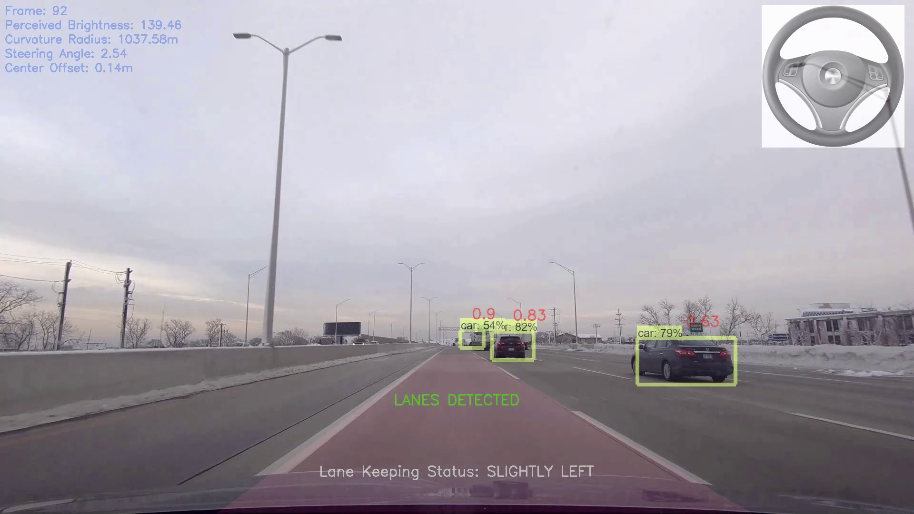
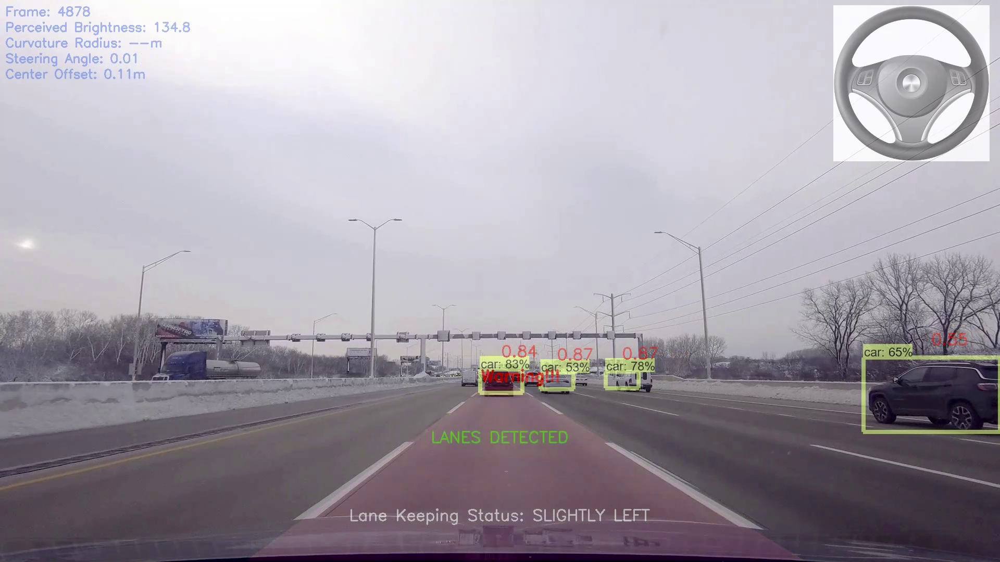

# Real-Time Driving Assistance System

Used Python (OpenCV and TensorFlow) to display detected lanes, lane-keeping status, steering angle suggestion,
detected objects with estimated distance, and brake warning on real driving footages.

### Sample Output

### Files Requirement
In object_detection folder/utils, need to manually re-download pre-trained models.
